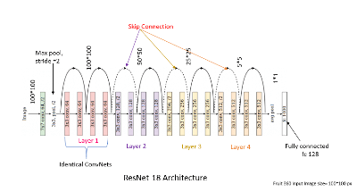

## Fullstack Project

### Introduction
This is a collaborative team project to put together and deploy a flask application with image classifier models. We started off with a given database of animal images (ants and bees) and build a classifier to properly classify them. We then proceeded to create a small database of random images and built and trained a second model with very good accuracy.

### Framework used
* [Pytorch](https://pytorch.org)
* [Flask](https://flask.palletsprojects.com)
* [HTML](https://html.spec.whatwg.org/)
* [CSS](https://www.w3.org/TR/CSS/#css)
* [ResNet18](https://https//pytorch.org/hub/pytorch_vision_resnet/)
* [MkDocs](https://www.mkdocs.org/)

### ResNet18 Architecture

